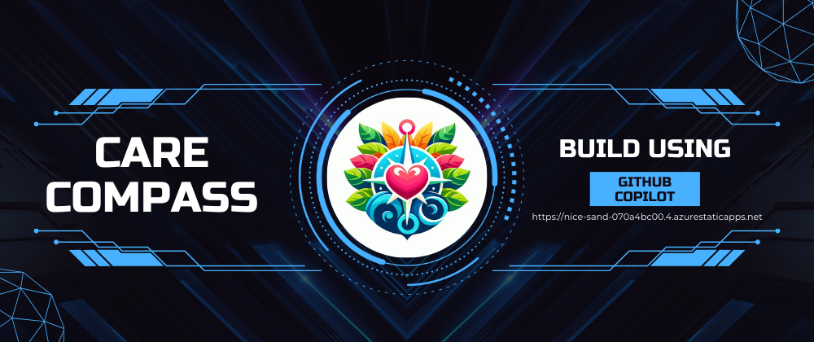

_This is a submission for the [GitHub Copilot Challenge ](https://dev.to/challenges/github): New Beginnings_

## What I Built

**CareCompass: Your Companion for Emotional Well-Being and Goal Success**

CareCompass is an AI-powered tool designed to help working professionals and students manage their goals while taking care of their emotional well-being. Whether you’re setting personal, professional, or educational goals, CareCompass keeps you organized and motivated.

It goes beyond just tracking goals—it provides personalized roadmaps for learning, sends reminders, and even supports you emotionally through a friendly chatbot. At the end of each day, you get a summary that highlights your progress, areas to improve, and actionable steps to keep you moving forward. CareCompass is more than a productivity tool; it’s a guide that grows with you.

### Why CareCompass?

Managing time, goals, and emotions is tough. Students often lose focus, professionals struggle to balance work and life, and everyone feels overwhelmed with achieving milestones. Most tools help with tasks but don’t address the emotional journey.

CareCompass fills this gap. It’s not just a tool to track progress—it’s like having a mentor and a friend, supporting you at every step with insights, encouragement, and clarity.

### Why It Works

CareCompass simplifies your life by helping you focus on what matters while supporting you emotionally. It’s not just about completing tasks—it’s about feeling good about your journey and staying motivated along the way.

With CareCompass, you’ll have a tool that understands your goals and helps you achieve them—one step at a time.

---

## Demo

<!-- Share a link to your app and include some screenshots, gifs, or videos here. -->

🎥 Video Demo: [Watch here](https://www.youtube.com/watch?v=EgEkRRca-Mg) for an in-depth demonstration of how I utilized GitHub Copilot to streamline the project, from coding to debugging and testing.

<iframe src="https://www.slideshare.net/slideshow/embed_code/key/gBLeE9yMUzPmDS?startSlide=1" width="597" height="486" frameborder="0" marginwidth="0" marginheight="0" scrolling="no" style="border:1px solid #CCC; border-width:1px; margin-bottom:5px;max-width: 100%;" allowfullscreen></iframe>
<strong><a href="https://www.slideshare.net/slideshow/carecompass-output-ppt-slides-for-demonstration/274977920" title="CareCompass: Comprehensive Product Implementation Overview" target="_blank">CareCompass: Comprehensive Product Implementation Overview</a></strong>

---

## Copilot Experience (GitHub Copilot: My Ultimate Productivity Partner )

<!-- Describe how you used Copilot throughout the development process, including prompts, edits, chat, autocomplete, model switcher, etc. -->

Embarking on a new project often feels like stepping into the unknown, especially when it involves multiple technologies, frameworks, and tight deadlines. But with GitHub Copilot, the journey becomes a guided and collaborative experience, much like having a seasoned developer by my side 24/7. From ideation to deployment, Copilot transformed every step of my development process into a seamless, efficient, and, dare I say, enjoyable endeavor.

### Phase 1: Project Kickoff and Code Setup

The project began with me pondering the right frameworks to use. Instead of spending hours comparing options, I asked Copilot, _"What framework would be efficient and fast to implement for my use case?"_ Its suggestion of Express.js for the backend and Flask for specific services, accompanied by a clear rationale, helped me decide in minutes.

Starting from scratch? Not with Copilot. A simple prompt like _"Generate the basic building blocks for a Flask project"_ resulted in a fully prepared workspace with all essential files and structure. It was like magic, but better—tailored precisely to my needs.

### Phase 2: Coding with Copilot

This phase showcased Copilot’s versatility and brilliance. While I initially intended to write code, Copilot’s autocomplete feature intervened even before I could finish typing function names. Its suggestions were not just accurate but also context-aware, offering multiple alternatives with a quick `Ctrl + Enter`.

One of my favorite features was the **model switcher**. Knowing that Claude Sonnet 3.5 excels in UI and design, I used it extensively for user-friendly and responsive components.

#### A Few Highlights of Copilot’s Magic

1. **Galaxy Stars Animation**  
   Inspired by GitHub’s homepage, I envisioned a floating logo surrounded by animated galaxy stars. My prompt:
   _"Create a floating logo with galaxy stars animation, including scaling and movement effects."_  
   Copilot iteratively refined the design with each follow-up prompt, making the stars shinier and more dynamic.

2. **Learning Roadmap Generator**  
   Using Copilot, I transformed a JSON learning roadmap into an interactive visualization. It suggested Mermaid.js for rendering and D3.js for animations. The results were breathtaking—an intuitive, animated roadmap that left me in awe.

3. **Dynamic Sidebar Generation**  
   I had a TailwindCSS sidebar template with irrelevant links and icons. By feeding both my routes file and the template into Copilot, I asked it to align the links and icons. The result? A fully customized sidebar with zero manual effort.

Copilot didn’t just assist—it practically became the lead developer, allowing me to focus on higher-level decisions while it handled repetitive coding tasks.

### Phase 3: Testing

Testing is often the Achilles’ heel of solo developers, especially in hackathons where speed is paramount. But Copilot turned it into a breeze. With a single command, _"@workspace/setupTests"_, it analyzed my workspace, suggested Mocha or Jest, and even generated unit tests for specific code snippets.

For someone who had never written unit tests before, this was a revelation. Testing became not just manageable but enjoyable.

### Phase 4: Debugging

Debugging can be a time sink, especially when working across multiple frameworks and languages. Copilot, however, proved to be a versatile troubleshooter.

- **Flask + MySQL Issue:** When SQLAlchemy threw connection errors, Copilot guided me through DB migration steps.
- **Vite React Environment Configuration:** It pinpointed the root cause of my environment variable issues.
- **CORS Error in Backend:** Copilot provided a concise and effective solution.

Its ability to adapt to different languages and frameworks meant I didn’t have to look elsewhere for help—Copilot was my all-in-one problem solver.

### Phase 5: Code Review and Documentation

Quality code is more than just functionality; it’s about readability and maintainability. Copilot’s **Review and Comment** feature took my code to the next level, highlighting areas for improvement, suggesting refactors, and even generating inline comments.

The `/explain` and `/fix` commands were lifesavers. When faced with complex warnings or errors, I selected the lines in question and asked Copilot to explain or resolve them. Its responses were clear, concise, and actionable.

Documentation, often an afterthought, became effortless. Copilot generated detailed documentation and commit messages, ensuring my project was well-documented and professional.

---

## GitHub Models

<!-- Did you use GitHub Models? If so, let us know how you used GitHub Models for prototyping LLM capabilities in your app. -->

Yes, GitHub Models played a pivotal role in the development of CareCompass. The core features of personalization and customization were built using the **OpenAI GPT-4o** model from GitHub Models. After extensive experimentation in the GitHub Models marketplace playground, I refined the prompts and prompt engineering techniques to achieve highly accurate results for our personalized chatbot.

For generating milestones and roadmaps, I leveraged the structured JSON schema response feature, which allowed us to easily create customizable, personalized roadmaps for users. Having worked with other LLMs, I found GitHub Models’ clear documentation and user-friendly playground particularly helpful for quick integration and effective prototyping.

In short, GitHub Models made the development process smoother and more efficient, helping me prototype and build powerful LLM capabilities for CareCompass with ease.

---

## Conclusion

This project, without Copilot, would have taken a week. With Copilot, I completed it in just 24 hours. It wasn’t just a tool—it was a co-creator, a mentor, and a productivity booster rolled into one.

GitHub Copilot didn’t just assist in building a productivity tool for “New Beginnings”; it epitomized the very concept. By enabling me to focus on creativity and problem-solving, Copilot transformed how I approach development.

If there’s one takeaway from this experience, it’s this: GitHub Copilot isn’t just the future of coding—it’s the present, and it’s here to stay.

<!-- Thanks for participating!  -->
